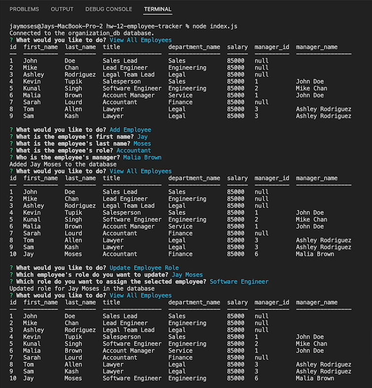
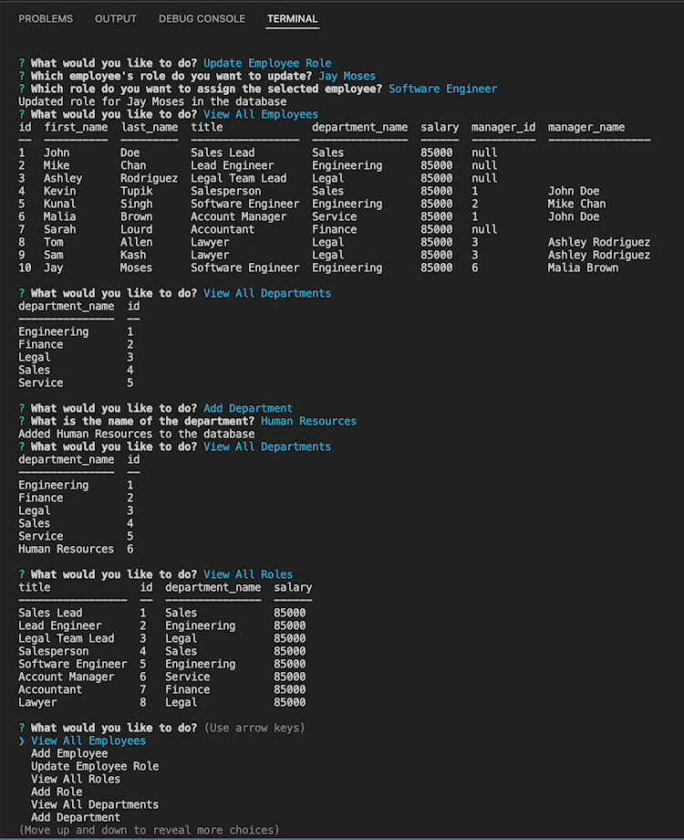
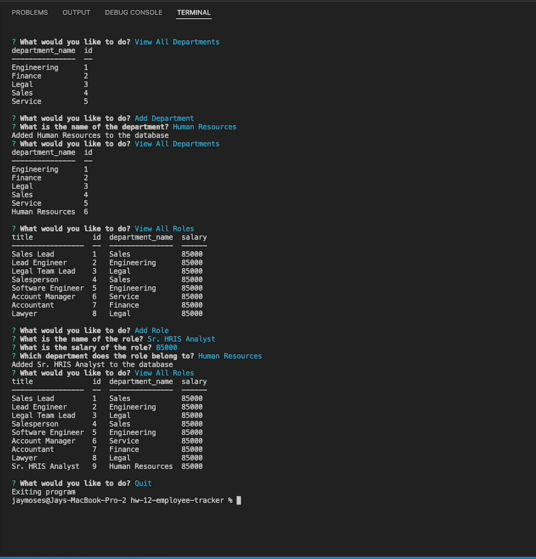

# Homework 12: Employee Tracker (Employee Management System)

## Description

I created an employee management system with the below functionality:

* Upon starting the application by typing and entering "node index.js" into the terminal, the user is presented with a menu of reports and actions they can select in relation to the organization database:
    * View all departments
        * Displays a formatted table with department names and department ID's.
    * View all roles
        * Displays a formatted table with job titles, role/title ID's, the department that each role belongs to, and the salary for each role.
    * View all employees
        * Displays a formatted table containing employee data, including employee ID's, first names, last names, job titles/roles, departments, salaries, and managers that each employee reports to.
    * Add a department
        * The user is prompted to enter the name of the department and that department is added to the database.
    * Add a role
        * The user is prompted to enter the name, salary, and department for the role and that role is added to the database.
    * Add an employee
        * The user is prompted to enter the employee’s first name, last name, role, and manager, and that employee is added to the database.
    * Update an employee's role
        * The user is prompted to select an employee to update and their new role and this information is updated in the database.
    * Quit
        * The user can exit the application by selecting "Quit".

## Screenshots of the application

## Application walkthrough video demo

A video demonstrating the functionality of this application can be found at the URL below.

URL of walkthrough video demo: https://drive.google.com/file/d/10z2v4_x1kqpTTmM7qFNruR_o8t9npst4/view?usp=sharing

## Technologies used

This application utilizes these technologies:

* Node.js
* JavaScript
* The [MySQL 2 NPM package](https://www.npmjs.com/package/mysql2)
* The [Inquirer NPM package](https://www.npmjs.com/package/inquirer)
* The [Console.Table NPM package](https://www.npmjs.com/package/console.table)

## Contact information

* Website: https://jaymoses01.github.io/hw-08-updated-portfolio-page/
* Email: JayRMoses@gmail.com

## MIT license

Permission is hereby granted, free of charge, to any person obtaining a copy
of this software and associated documentation files (the "Software"), to deal
in the Software without restriction, including without limitation the rights
to use, copy, modify, merge, publish, distribute, sublicense, and/or sell
copies of the Software, and to permit persons to whom the Software is
furnished to do so, subject to the following conditions:

The above copyright notice and this permission notice shall be included in all
copies or substantial portions of the Software.

THE SOFTWARE IS PROVIDED "AS IS", WITHOUT WARRANTY OF ANY KIND, EXPRESS OR
IMPLIED, INCLUDING BUT NOT LIMITED TO THE WARRANTIES OF MERCHANTABILITY,
FITNESS FOR A PARTICULAR PURPOSE AND NONINFRINGEMENT. IN NO EVENT SHALL THE
AUTHORS OR COPYRIGHT HOLDERS BE LIABLE FOR ANY CLAIM, DAMAGES OR OTHER
LIABILITY, WHETHER IN AN ACTION OF CONTRACT, TORT OR OTHERWISE, ARISING FROM,
OUT OF OR IN CONNECTION WITH THE SOFTWARE OR THE USE OR OTHER DEALINGS IN THE
SOFTWARE.